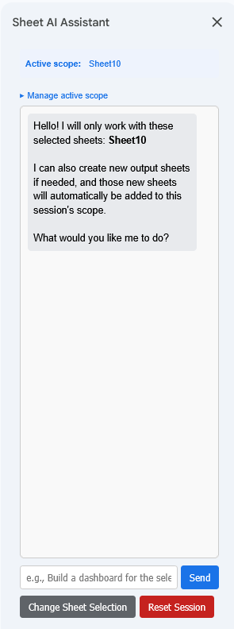

# Google Sheets AI Copilot

An AI chat assistant that lives inside your Google Sheet. You talk to it in a sidebar, it reads your data, and it can make changes to your spreadsheet directly — adding data, building dashboards, applying formatting, creating charts, writing formulas, and more.

---

## What it does

- Opens a chat panel inside any Google Sheet (no external tools or browser extensions needed)
- You tell it what you want in plain language — it figures out the steps and does the work
- You choose which sheets it is allowed to read and edit; it cannot touch anything outside that selection
- It can create new sheets (for summaries, dashboards, reports) and immediately write to them
- If it writes a formula that produces an error, it automatically detects the problem and fixes it without you having to ask
- Your chat history and selected sheets are remembered when you close and reopen the sidebar

### Examples of things you can ask

- *"Summarise the data in Sheet1 and create a new dashboard sheet"*
- *"Add a bar chart showing sales by region"*
- *"Highlight all rows where the value in column C is over 1000"*
- *"Add a dropdown to column B with the options: Pending, In Progress, Done"*
- *"Calculate the total for each category and put it in a new column"*
- *"Freeze the top row and make it bold"*

---

## How it works 

1. You open the chat panel and select which sheets the AI is allowed to work with.
2. You type a message describing what you want.
3. The script reads your selected sheets and sends the data — along with your message — to an AI model via an API you configure.
4. The AI replies with a structured list of changes to make.
5. The script applies those changes directly to your spreadsheet.
6. If any formula it wrote is broken, it automatically sends a follow-up to the AI to fix it, then applies the correction — all before the response appears in your chat.

---

## Requirements

- A Google account with access to Google Sheets and Google Apps Script
- An API key from any AI provider that supports the **OpenAI-compatible chat completions format** (e.g. OpenAI, Anthropic via a proxy, Azure OpenAI, or similar)

---

## Setup

### Step 1 — Copy the code into Apps Script

1. Open (or create) the Google Sheet you want to use.
2. Click **Extensions → Apps Script** in the top menu.
3. Delete any placeholder code already in the editor.
4. Copy the contents of **`Code.js`** from this repository and paste it into the editor.
5. Click the **+** icon next to "Files" in the left sidebar and choose **HTML**. Name it exactly `Sidebar` (no extension). Delete the default content and paste in the contents of **`Sidebar.html`**.
6. Click **Save** (the floppy disk icon, or `Ctrl+S` / `Cmd+S`).

### Step 2 — Add your API settings

The script needs three pieces of information to connect to your AI provider. These are stored in **Script Properties** — a secure settings area inside Apps Script that is never visible to anyone who views the spreadsheet or the code.

1. In the Apps Script editor, click the **⚙ Project Settings** icon in the left sidebar.
2. Scroll down to the **Script Properties** section.
3. Click **Add script property** and add each of the following:

| Property name | What to put here |
|---|---|
| `AI_API_KEY` | Your API key from your AI provider (e.g. starts with `sk-...` for OpenAI) |
| `AI_API_ENDPOINT` | The full URL of the chat completions endpoint (see examples below) |
| `AI_MODEL` | The name of the model you want to use (see examples below) |

4. Click **Save script properties**.

#### Endpoint and model examples by provider

| Provider | `AI_API_ENDPOINT` | Example `AI_MODEL` |
|---|---|---|
| OpenAI | `https://api.openai.com/v1/chat/completions` | `gpt-4o` |
| Anthropic (via proxy) | *(your proxy URL)* | `claude-sonnet-4-6` |
| Azure OpenAI | `https://<your-resource>.openai.azure.com/openai/deployments/<deployment>/chat/completions?api-version=2024-02-01` | `gpt-4o` |

> Any provider that accepts the standard OpenAI `POST /chat/completions` message format will work.

### Step 3 — Reload the sheet and open the assistant

1. Close the Apps Script editor tab.
2. Reload your Google Sheet.
3. A new menu item called **🤖 AI Assistant** will appear in the top menu bar. Click it and choose **Open Chat**.

> If the menu does not appear after reloading, go back to Apps Script, click **Run → onOpen**, and approve any permissions it asks for. Then reload the sheet.

---

## Using the assistant

### Selecting sheets

When you first open the sidebar you will see a list of all the tabs in your spreadsheet. Check the ones you want the AI to be able to read and modify, then click **Start Chat**.

- The AI can only see and edit the sheets you selected. Everything else is off-limits.
- If you ask it to, it can create brand new sheets for output (dashboards, summaries, etc.) — those are automatically added to its working scope.
- Your selection is saved and restored next time you open the sidebar.

### Chatting

Type your request in the text box at the bottom and press **Enter** or click **Send**. The assistant will think, make the changes, and tell you what it did.

You can have a back-and-forth conversation — it remembers the context of the current session, so you can say things like *"now sort it by date"* or *"do the same for Sheet2"* without explaining everything again.

### Managing scope mid-conversation

Click **Manage active scope** (the collapsible section at the top of the chat view) to add or remove sheets from the AI's working set without resetting your conversation. Click **Apply Scope Changes** to confirm.

### Resetting

- **Change Sheet Selection** — goes back to the sheet picker without clearing the chat history.
- **Reset Session** — clears the chat history and the selected sheets entirely. Useful for starting a fresh task.

---

## Troubleshooting

**The 🤖 AI Assistant menu doesn't appear**
Run the `onOpen` function manually from the Apps Script editor (select it in the function dropdown and click ▶ Run), approve any permissions requested, then reload the sheet.

**"AI_API_KEY not found in Script Properties"**
You skipped or mistyped one of the Script Properties in Step 2. Go to Project Settings → Script Properties and check all three entries are present and spelled exactly as shown.

**"API returned non-JSON response"**
Usually means the endpoint URL or model name is wrong, or the API key is invalid. Double-check all three Script Properties. You can also check the raw error detail in the Apps Script execution log (View → Executions).

**The AI made a change I didn't want**
Use `Ctrl+Z` / `Cmd+Z` in the spreadsheet to undo. Google Sheets keeps a full undo history.

**The sidebar says "Failed to load sidebar state"**
Reload the sheet and reopen the sidebar. If it persists, open Apps Script → Project Settings and check that the script has not hit its quota limits (Apps Script has a daily execution time limit on free Google accounts).

---

## File overview

| File | Purpose |
|---|---|
| `Code.js` | All server-side logic: API calls, spreadsheet reading and editing, formula validation |
| `Sidebar.html` | The chat panel UI that runs inside the Google Sheets sidebar |
| `appsscript.json` | Apps Script project configuration |
| `README.js` | Detailed technical documentation for developers |

---

## Contributing

Pull requests are welcome. For significant changes, please open an issue first to discuss what you would like to change.

---

## License

[MIT](LICENSE)
